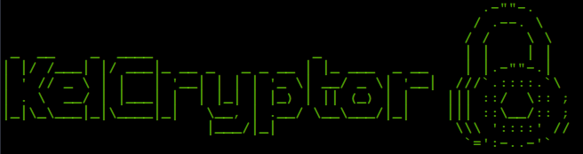

# kelcryptor

A commandline file encryption and decryption application, written in [Go](https://golang.org).

## Features

- AES-256-GCM encryption
- No limit on file size to be encrypted
- Keeps track of the integrity of encrypted file
- Get alert if wrong password is used without having to wait for the entire file to be decrypted
- Pass multiple files at once
- Ignore and skip files with errors when encrypting many files
- Keeps track of time taken to encrypt/decrypt file(s)

## Installation

Run `go build` and add the resulting binary to your PATH
