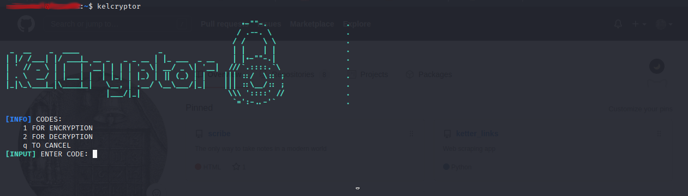

# kelcryptor

**kelcryptor is a python encryption program with the following features:**
1. AES-256-GCM encryption
2. Uses scrypt KDF to derive cryptographically strong encryption keys from users' passwords
3. File shredding capabilities
4. Reads input file in chunks so as not to fill up memory when encrypting/decrypting a large file
5. Encrypt more than one file at once
6. Tab autocompletion for file inputs
7. Check time taken for encryption/decryption/shredding


### **Requirements**
1. Python 3
2. Python *pycryptodome* module

To install the *pycryptodome* module:
```
pip3 install pycryptodome
```

## ***Tested on***

- Kali Linux
- Manjaro 20.2
- Linux Mint 20

## **Usage**
Usage: kelcryptor.py [OPTION] [FILES]...

Options:

* -h, --help                Show usage
* -t, --time                Show time taken after encryption or decryption is finished
* -v, --version             Show kelcryptor version number

Note:
1. Input files MUST be regular files
2. The file paths can be either relative or absolute
3. For multi-file mode, the multiple files are added as arguments after the program name (kelcryptor.py)
4. There MUST be more than one file for multi-file mode
5. For single-file mode, no file arguments should be added after the program name

Examples:
*   kelcryptor.py ./foo ./bar     # Start kelcryptor in multi-file mode for files foo and bar
*   kelcryptor.py -h              # Show usage
*   kelcryptor.py                 # Start kelcryptor in single-file mode
*   kelcryptor -t ./foo ./bar     # Show time taken for multi-file mode (multi-file mode rules still apply)
*   kelcryptor -t                 # Show time taken for single-file mode
